# (c# 코딩) 그림판 (SimplePaint)  

## 개요 
-c# 프로그래밍 학습

-설명 : 선, 사각형, 원을 그릴 수 있는 그림판 프로그램

-사용한 플랫폼 : net windows forms, visual studio, git hub 

-사용한 컨트롤 : Label 1개(제목), GroupBox 3개, Button 7개, 
Panel 1개, ComboBox 1개, TrackBar 1개, PictureBox 1ㅐ,

-사용한 기술과 구현한 기능 : 
 -  컨트롤 배치와 기본적인 속성 제어 
 -  데이터 처리 및 연산 로직
 -  문자열 처리 및 동적 텍스트 결합
 -  사용자 편의 기능 
  
  - GDI+ 기반 드로잉: Graphics 객체를 활용하여 직선, 사각형, 원 등 기본적인 도형 그리기 로직 구현.

  - 다양한 포맷 저장: SaveFileDialog를 활용하여 사용자가 그린 그림을 .png, .jpg, .bmp 등 세 가지 주요 이미지 포맷으로 저장하는 기능 구현

  - 가변 배율 확대/축소(Zooming): zoomRatio 변수를 활용하여 캔버스를 20% 단위로 확대 및 축소할 수 있는 기능 구현.

## 실행 화면 (과제1)
   -과제 1 코드의 실행 스크린

   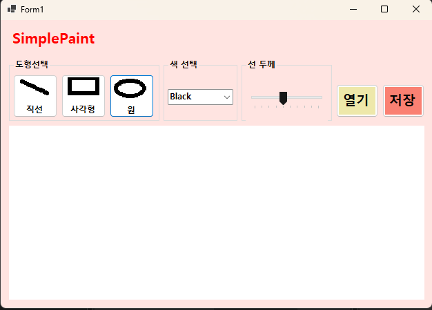

   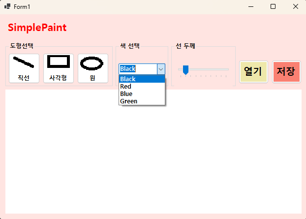

   
   
   - 과제내용
   
   - 컨트롤 배치와 기본적인 속성 설정

   - 컨트롤 이름 정하기

   - 도형 선택, 색상 선택, 선 굵기 선택 기능 구현
   
   
   
   - 구현한 내용 (위 그림 참조)

   - 도형 선택(Button), 색상 선택(ComboBox), 굵기 조절(TrackBar) 등 기능별로 컨트롤을 배치하고, btnLine, cmbColor, trbLineWidth와 같이 용도가 명확한 이름을 부여하여 코드 가독성과 유지보수성 확보

   - SelectedIndexChanged와 ValueChanged 이벤트를 활용해 사용자가 선택한 색상과 굵기 데이터를 실시간으로 변수에 저장하고, 이를 Pen 객체에 즉시 반영하여 그리기 환경을 동적으로 변화시키는 로직 구현.

   - enum으로 정의된 도구 상태(Line, Rectangle, Circle)에 따라 switch 문을 실행하여, 하나의 마우스 이벤트 안에서 선택된 버튼에 맞춰 각기 다른 도형이 그려지도록 하는 통합 제어 로직 구현.

## 실행 화면 (과제2)
   -과제  코드의 실행 스크린

   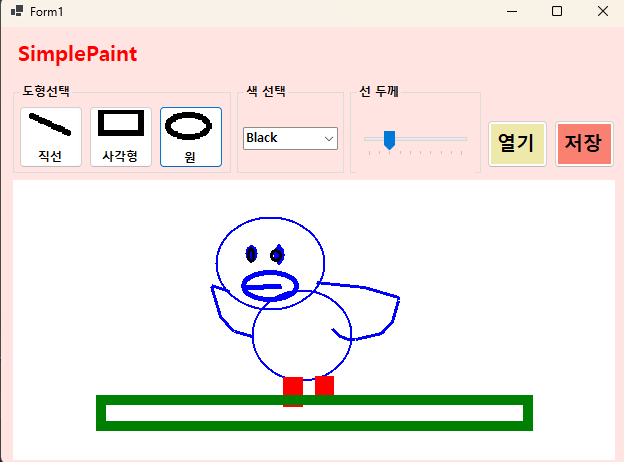

   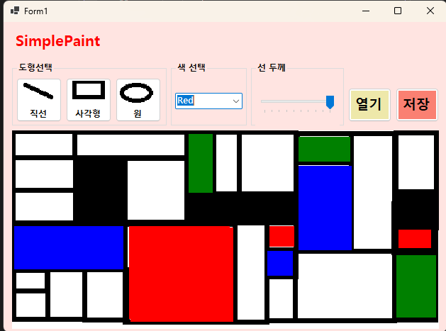

   
   - 과제내용
   
   - 마우스 드래그를 이용한 그림 그리기 기능 구현
   
   - 직선, 사각형, 원 그리기 기능 구현
   

   
   - 구현한 내용 (위 그림 참조)

     - enum을 활용한 도구 선택(직선, 사각형, 원) 및 TrackBar를 이용한 실시간 선 굵기(1~10px) 조절 기능 구현

     - MouseDown, MouseMove, MouseUp 이벤트를 조합하여 그리기의 시작점과 끝점을 정확히 산출하고, 드래그 중에는 Paint 이벤트를 통해 도형의 크기를 실시간으로 보여주는 미리보기 기능 구현.

     - 마우스를 어느 방향(왼쪽 위, 오른쪽 아래 등)으로 드래그하더라도 Math.Min과 Math.Abs 함수를 이용해 사각형 영역을 계산하여 도형이 깨지지 않고 정상적으로 그려지도록 처리.

## 실행 화면 (과제3)
   -과제 3 코드의 실행 스크린

   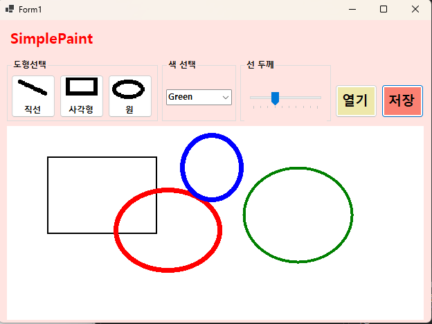

   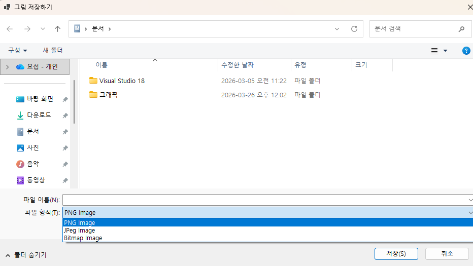

   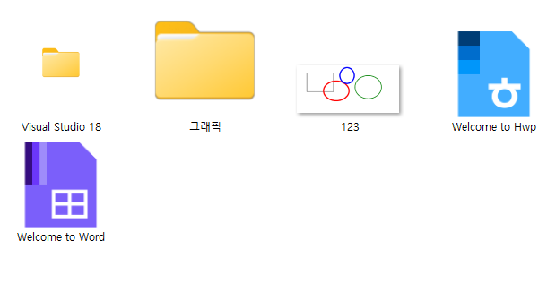

   
   
   - 과제내용
   
   - 그려진 그림을 이미지 파일로 저장하는 기능 구현

   - 3가지 포맷으 로저장

   
   - 구현한 내용 (위 그림 참조)

   - SaveFileDialog를 연동하여 사용자가 원하는 저장 경로와 파일명을 직접 지정할 수 있는 윈도우 표준 인터페이스 구현.

   - 파일 저장 전 Filter 속성을 설정하여 .png, .jpg, .bmp 세 가지 확장자만 선택 가능하도록 사용자 입력 제한.

   - 투명도가 유지되는 PNG, 압축률이 높은 JPG, 무손실 데이터인 BMP의 특성을 각각 살려 파일이 생성되도록 처리.

## 실행 화면 (과제4)
   -과제 4 코드의 실행 스크린

   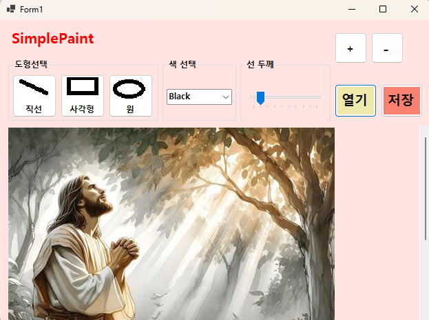

   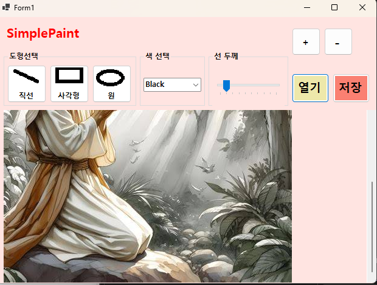

   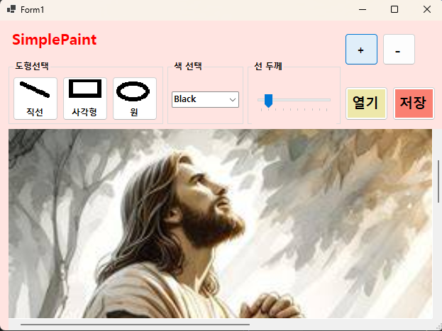

   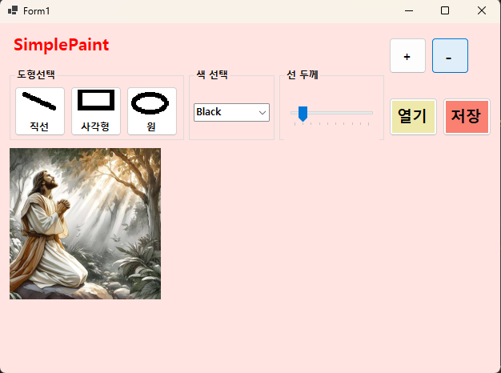
   
   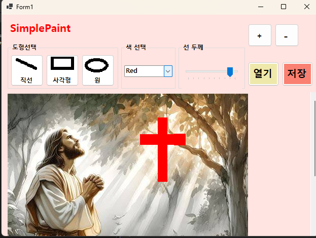
   
   
   - 과제내용
   
   - 외부에서 이미지 파일을 읽어 들여서 캔버스로 사용

   - 이미지 크기에 맞춰 캔버스 크기 조정

   - 이미지 크기가 큰 경우 스크롤바 만들기

   - 확대/축소 기능 넣기

   
   - 구현한 내용 (위 그림 참조)

   - OpenFileDialog를 통해 선택한 외부 이미지를 비트맵 객체로 로드하고, 이미지의 해상도에 맞춰 canvasBitmap과 PictureBox의 크기를 자동으로 재설정하여 원본 이미지를 훼손 없이 캔버스로 변환하는 기능 구현

   - Panel 컨트롤의 AutoScroll 기능을 활성화하고 PictureBox를 내부에 배치하여, 화면보다 큰 고해상도 이미지를 불러올 경우 상하좌우 스크롤을 통해 전체 영역을 자유롭게 탐색하고 편집할 수 있는 인터페이스 구축.

   - zoomRatio 변수를 이용해 캔버스를 20% 단위로 확대/축소하는 기능을 구현하고, 화면 배율이 변하더라도 마우스 클릭 위치가 실제 이미지의 픽셀 좌표와 일치하도록 (e.X / zoomRatio) 연산을 적용한 좌표 역산 로직 구현.

   #배운내용

   - Graphics 객체와 마우스 이벤트(MouseDown, MouseMove, MouseUp)의 상관관계를 이해하고, 비트맵(Bitmap)에 영구적으로 그림을 저장하는 데이터 처리 방식과 Paint 이벤트를 이용한 실시간 미리보기 기능을 분리하여 구현하는 방법을 익혔습니다

   - ComboBox, TrackBar, Button 등 다양한 UI 컨트롤을 배치하고, 여기서 발생하는 데이터를 변수에 저장하여 실제 그리기 도구(Pen)의 속성에 실시간으로 반영하는 사용자 중심의 프로그램 설계 방식을 학습했습니다.

   - SaveFileDialog와 OpenFileDialog를 활용한 파일 관리 기법을 습득하였으며, 특히 Panel의 스크롤 기능과 PictureBox의 확대/축소 로직을 통해 사용자에게 편리한 작업 환경(View)을 제공하는 기술적 해결 능력을 길렀습니다.
